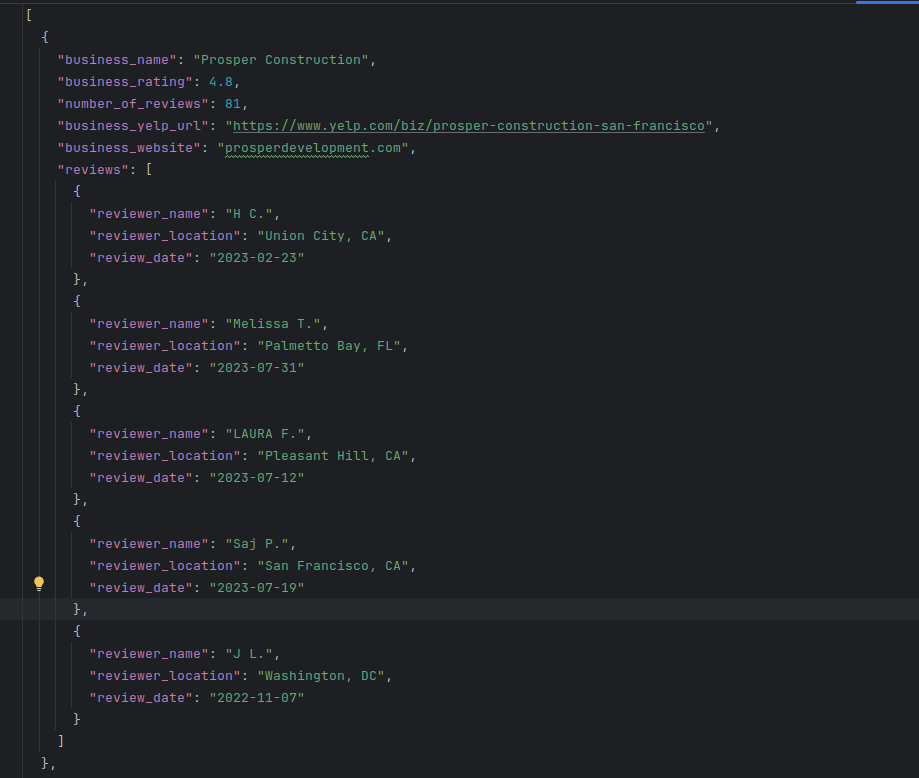

# Yelp Business Crawler

A simple yet effective crawler to fetch business information based on category and location from Yelp. The result is formatted as a JSON file with the given business attributes.

## Features:

- Input a category (e.g., "contractors") and a location (e.g., "San Francisco, CA").
- Output is a JSON file with relevant business details.
  
## Business Details:

Each business object will consist of:

- Business name
- Business rating
- Number of reviews
- Business yelp url
- Business website
- List of first 5 reviews:
  - Reviewer name
  - Reviewer location
  - Review date

## Usage:

```
scrapy crawl shop_info -o output.json 
```

This will return a `output.json` file with the business details.

## Dependencies:

- Python 3.x
- Install them using `pip install -r requirements.txt`.

## Notes:

- Ensure you are not violating Yelp's terms of service when using this crawler.
- This is a basic version of the crawler and may not handle all edge cases or massive amounts of data. Adjust and scale as per your needs.

## Output:

